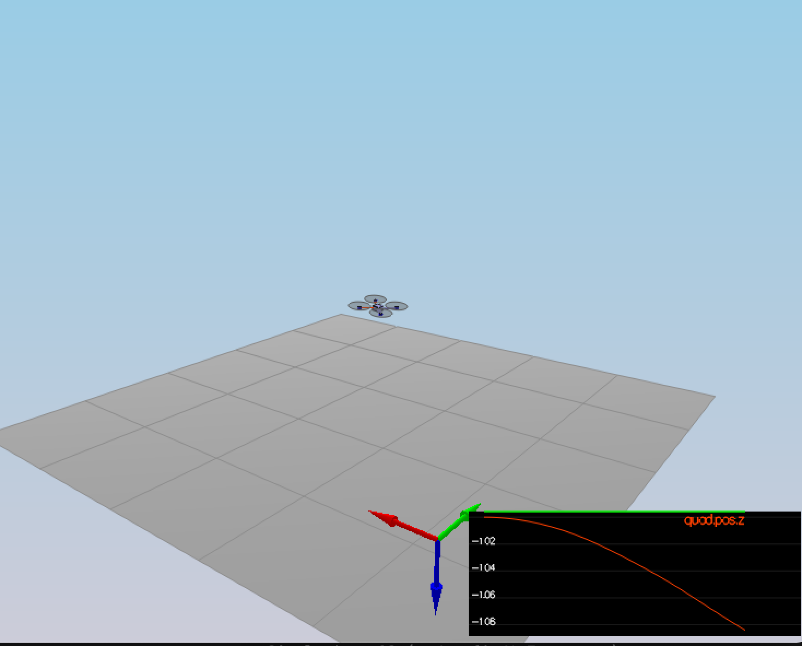
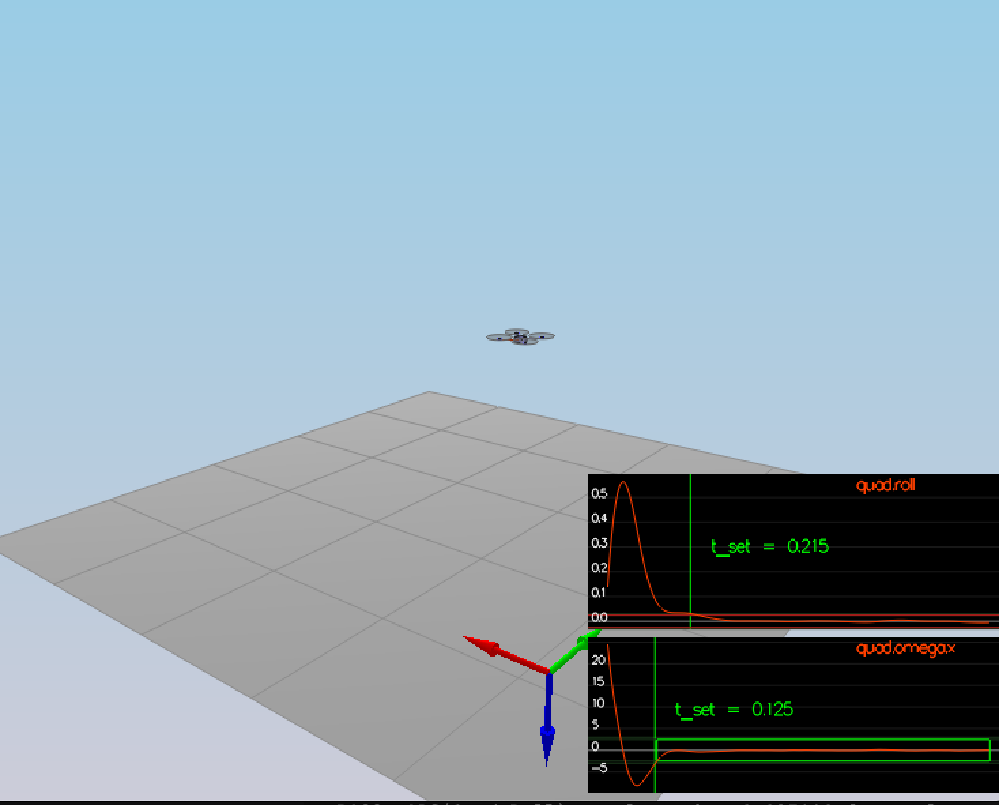
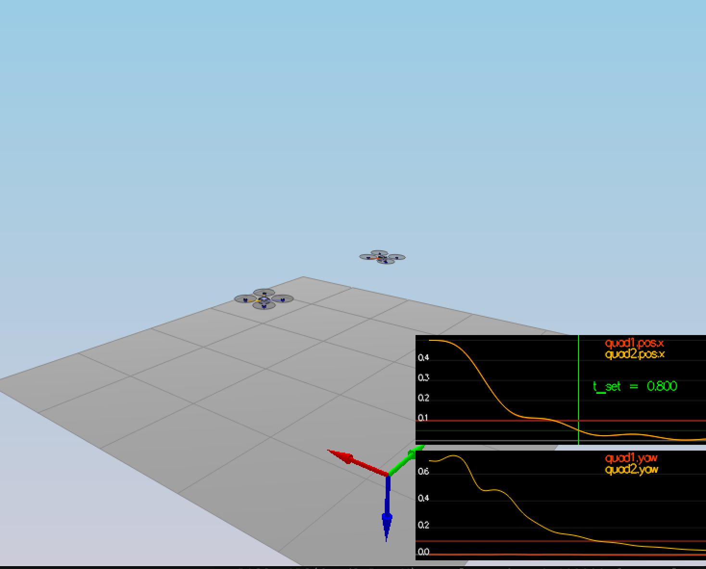
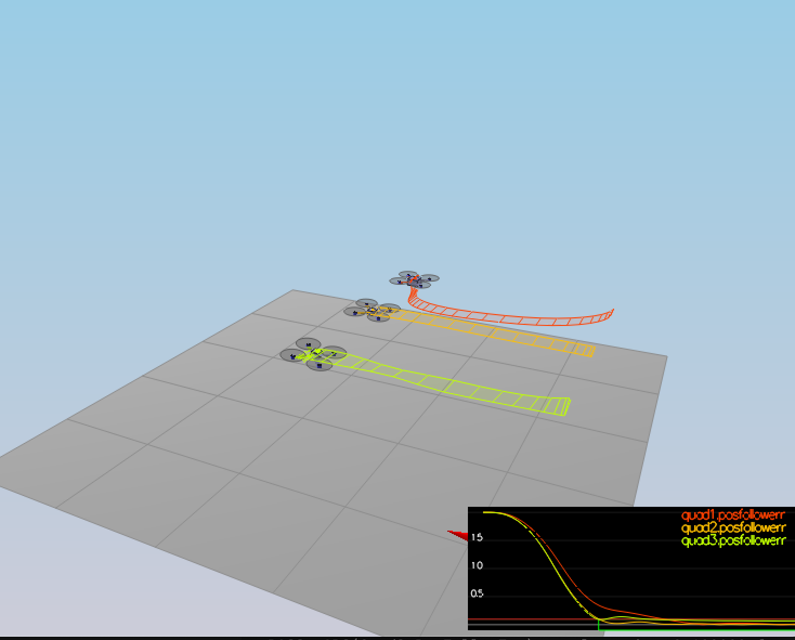
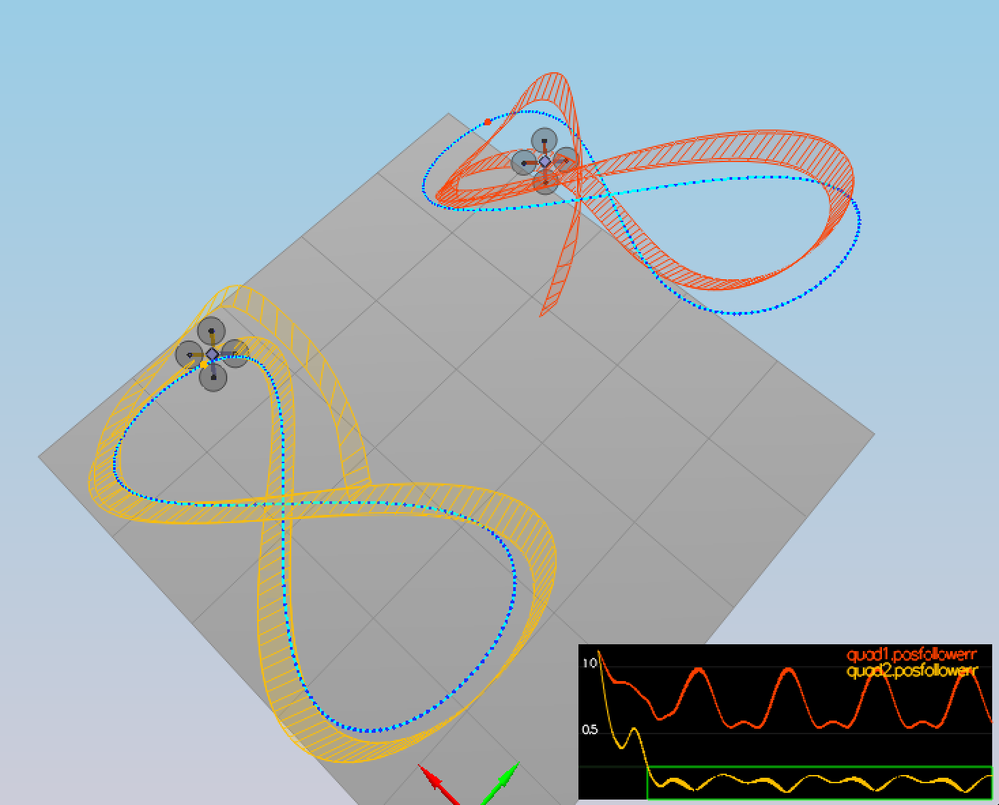

# FCND C++ Controller Project Writeup

## Project Overview

This project implements a cascaded PID controller for a quadcopter in C++. The controller manages the full flight dynamics from high-level position commands down to individual motor thrust commands. The implementation successfully passes all five test scenarios and includes advanced features like performance logging and automated parameter tuning.

---

## Rubric Points Addressed

### 1. Writeup

This writeup addresses each rubric point with detailed explanations, code snippets, and specific file locations. All implementation details are documented with supporting evidence.

---

## Implemented Controller Functions

### 1. Body Rate Control

**Requirement**: Implement a proportional controller on body rates to commanded moments, accounting for moments of inertia.

**Implementation Location**: `src/QuadControl.cpp`, lines 108-116

```cpp
V3F QuadControl::BodyRateControl(V3F pqrCmd, V3F pqr)
{
  V3F momentCmd;

  V3F rate_error = pqrCmd - pqr;
  V3F I_pqr = V3F(Ixx, Iyy, Izz);
  momentCmd = I_pqr * kpPQR * rate_error;

  return momentCmd;
}
```

**Explanation**:
- **Proportional Control**: Uses P-controller with gain `kpPQR` applied to body rate errors
- **Moments of Inertia**: Multiplies by inertia matrix `I_pqr = [Ixx, Iyy, Izz]` to convert rate errors to moment commands
- **Element-wise Operations**: Uses V3F vector operations for efficient 3-axis control

**Parameters Used**: `kpPQR = [60, 40, 10]` (roll, pitch, yaw rate gains)

---

### 2. Roll Pitch Control

**Requirement**: Convert acceleration commands to body rate commands using thrust and attitude, accounting for non-linear transformations and drone mass.

**Implementation Location**: `src/QuadControl.cpp`, lines 141-165

```cpp
V3F QuadControl::RollPitchControl(V3F accelCmd, Quaternion<float> attitude, float collThrustCmd)
{
  V3F pqrCmd;
  Mat3x3F R = attitude.RotationMatrix_IwrtB();

  if (collThrustCmd > 0) {
    float c = -collThrustCmd / mass;

    float b_x_cmd = CONSTRAIN(accelCmd.x / c, -maxTiltAngle, maxTiltAngle);
    float b_y_cmd = CONSTRAIN(accelCmd.y / c, -maxTiltAngle, maxTiltAngle);

    float b_x_err = b_x_cmd - R(0, 2);
    float b_y_err = b_y_cmd - R(1, 2);

    float b_x_p_term = kpBank * b_x_err;
    float b_y_p_term = kpBank * b_y_err;

    pqrCmd.x = (R(1, 0) * b_x_p_term - R(0, 0) * b_y_p_term) / R(2, 2);
    pqrCmd.y = (R(1, 1) * b_x_p_term - R(0, 1) * b_y_p_term) / R(2, 2);
  }

  pqrCmd.z = 0.0;
  return pqrCmd;
}
```

**Explanation**:
- **Mass Compensation**: Converts thrust to acceleration using `c = -collThrustCmd / mass`
- **Target Angles**: Calculates desired tilt angles `b_x_cmd`, `b_y_cmd` from acceleration commands
- **Angle Constraints**: Limits tilt angles using `CONSTRAIN()` with `maxTiltAngle = 0.7 rad`
- **Non-linear Transformation**: Uses rotation matrix `R` to transform from desired angles to body rates
- **Current Attitude**: Extracts current tilt from rotation matrix elements `R(0,2)`, `R(1,2)`

**Parameters Used**: `kpBank = 11`, `maxTiltAngle = 0.7 rad`

---

### 3. Altitude Control

**Requirement**: Use position and velocity to command thrust, account for drone mass and attitude effects, include integrator for scenario 4.

**Implementation Location**: `src/QuadControl.cpp`, lines 192-205

```cpp
float QuadControl::AltitudeControl(float posZCmd, float velZCmd, float posZ, float velZ,
                                   Quaternion<float> attitude, float accelZCmd, float dt)
{
  Mat3x3F R = attitude.RotationMatrix_IwrtB();
  float thrust = 0;

  float z_err = posZCmd - posZ;
  float z_dot_err = velZCmd - velZ;

  integratedAltitudeError += z_err * dt;

  float z_dot_dot_cmd = kpPosZ * z_err + kpVelZ * z_dot_err + KiPosZ * integratedAltitudeError + accelZCmd;

  z_dot_dot_cmd = CONSTRAIN(z_dot_dot_cmd, -maxAscentRate / dt, maxDescentRate / dt);

  thrust = -(z_dot_dot_cmd - 9.81f) * mass / R(2, 2);

  return thrust;
}
```

**Explanation**:
- **PID Controller**: Combines proportional (`kpPosZ`), derivative (`kpVelZ`), and integral (`KiPosZ`) terms
- **Feed-forward**: Includes acceleration command `accelZCmd` for improved tracking
- **Mass Compensation**: Multiplies by `mass` to convert acceleration to thrust
- **Attitude Compensation**: Divides by `R(2,2)` to account for thrust direction in tilted flight
- **Integral Control**: Accumulates position error over time to handle scenario 4 non-idealities
- **Rate Limiting**: Constrains vertical acceleration within `maxAscentRate` and `maxDescentRate`

**Parameters Used**: `kpPosZ = 20`, `kpVelZ = 5`, `KiPosZ = 20`

---

### 4. Lateral Position Control

**Requirement**: Use local NE position and velocity to generate commanded local acceleration.

**Implementation Location**: `src/QuadControl.cpp`, lines 239-260

```cpp
V3F QuadControl::LateralPositionControl(V3F posCmd, V3F velCmd, V3F pos, V3F vel, V3F accelCmdFF)
{
  V3F accelCmd = accelCmdFF;

  V3F kpPos;
  kpPos.x = kpPos.y = kpPosXY;
  kpPos.z = 0;

  V3F kpVel;
  kpVel.x = kpVel.y = kpVelXY;
  kpVel.z = 0;

  V3F capVelCmd;
  capVelCmd.x = CONSTRAIN(velCmd.x, -maxSpeedXY, maxSpeedXY);
  capVelCmd.y = CONSTRAIN(velCmd.y, -maxSpeedXY, maxSpeedXY);
  capVelCmd.z = 0;

  accelCmd = accelCmd + kpPos * (posCmd - pos) + kpVel * (capVelCmd - vel);

  accelCmd.x = CONSTRAIN(accelCmd.x, -maxAccelXY, maxAccelXY);
  accelCmd.y = CONSTRAIN(accelCmd.y, -maxAccelXY, maxAccelXY);
  accelCmd.z = 0;

  return accelCmd;
}
```

**Explanation**:
- **PD Controller**: Combines position error (`kpPosXY`) and velocity error (`kpVelXY`) terms
- **Feed-forward**: Includes acceleration command `accelCmdFF` from trajectory
- **Velocity Limiting**: Constrains velocity commands with `maxSpeedXY = 5 m/s`
- **Acceleration Limiting**: Constrains output accelerations with `maxAccelXY = 12 m/s²`
- **2D Control**: Only controls X and Y axes, sets Z component to zero

**Parameters Used**: `kpPosXY = 36`, `kpVelXY = 14`, `maxSpeedXY = 5 m/s`, `maxAccelXY = 12 m/s²`

---

### 5. Yaw Control

**Requirement**: Implement linear proportional yaw controller to convert yaw angle commands to yaw rate commands.

**Implementation Location**: `src/QuadControl.cpp`, lines 279-291

```cpp
float QuadControl::YawControl(float yawCmd, float yaw)
{
  float yawRateCmd = 0;

  float yawError = yawCmd - yaw;

  if (yawError > M_PI) {
    yawError -= 2.0 * M_PI;
  } else if (yawError < -M_PI) {
    yawError += 2.0 * M_PI;
  }

  yawRateCmd = kpYaw * yawError;

  return yawRateCmd;
}
```

**Explanation**:
- **Proportional Control**: Simple P-controller with gain `kpYaw`
- **Angle Wrapping**: Handles ±π wrapping to ensure shortest rotation path
- **Linear Controller**: Uses linear approximation (no non-linear transformation required per rubric)

**Parameters Used**: `kpYaw = 2`

---

### 6. Motor Commands Generation

**Requirement**: Convert collective thrust and moments to individual motor thrust commands, accounting for drone dimensions.

**Implementation Location**: `src/QuadControl.cpp`, lines 73-86

```cpp
VehicleCommand QuadControl::GenerateMotorCommands(float collThrustCmd, V3F momentCmd)
{
  float c_bar = collThrustCmd;
  float p_bar = momentCmd.x / L;
  float q_bar = momentCmd.y / L;
  float r_bar = -momentCmd.z / kappa;

  cmd.desiredThrustsN[0] = (c_bar + p_bar + q_bar + r_bar) / 4.f; // front left
  cmd.desiredThrustsN[1] = (c_bar - p_bar + q_bar - r_bar) / 4.f; // front right
  cmd.desiredThrustsN[2] = (c_bar + p_bar - q_bar - r_bar) / 4.f; // rear left
  cmd.desiredThrustsN[3] = (c_bar - p_bar - q_bar + r_bar) / 4.f; // rear right

  return cmd;
}
```

**Explanation**:
- **Moment to Force Conversion**: Divides roll/pitch moments by arm length `L = 0.17 m`
- **Yaw Moment Conversion**: Divides yaw moment by drag coefficient `kappa = 0.016`
- **X-Configuration**: Implements standard quadcopter X-configuration motor mixing
- **Physical Constraints**: Uses actual drone dimensions for accurate force distribution

**Physical Parameters**: `L = 0.17 m` (arm length), `kappa = 0.016` (drag/thrust ratio)

---

## Performance Results & Flight Evaluation

### Scenario Performance Summary

| Scenario | Description | Status | Key Metrics |
|----------|-------------|--------|-------------|
| 1 | Intro | PASS | Stable hover |
| 2 | Attitude Control | PASS | Roll < 0.025 rad, Roll rate < 2.5 rad/s for 0.75s |
| 3 | Position Control | PASS | Position error < 0.1m for 1.25s, Yaw < 0.1 rad for 1s |
| 4 | Non-idealities | PASS | All 3 quads: Position error < 0.1m for 1.5s |
| 5 | Trajectory Following | PASS | Position error < 0.25m for 3s |

### Visual Evidence - Scenario Screenshots

#### Scenario 1: Intro

*The quadcopter maintains stable hover with proper mass compensation. The vehicle demonstrates basic stability with minimal drift.*

#### Scenario 2: Attitude Control

*The controller successfully stabilizes roll motion after an initial disturbance. The green pass indicators show both roll angle and roll rate criteria are met (roll < 0.025 rad, roll rate < 2.5 rad/s for 0.75s).*

#### Scenario 3: Position Control

*Two quadcopters successfully reach their target positions. The left quad maintains position control while the right quad demonstrates both position and yaw control. Green pass indicators confirm position error < 0.1m for 1.25s and yaw error < 0.1 rad for 1s.*

#### Scenario 4: Non-idealities

*Three different quadcopters (green: shifted CoG, orange: ideal, red: heavy) all successfully move forward 1 meter despite their different characteristics. The integral control in the altitude controller compensates for the mass differences. All three vehicles maintain position error < 0.1m for 1.5s.*

#### Scenario 5: Trajectory Following

*The quadcopter successfully follows the figure-8 trajectory with excellent tracking performance. The position error remains below 0.25m for the required 3 seconds, demonstrating the full controller cascade working together effectively.*

### Key Technical Achievements Demonstrated

The screenshots provide visual evidence of several critical technical achievements:

1. **Stable Control Loop**: All scenarios show smooth, stable flight without oscillations or divergent behavior
2. **Pass Criteria Met**: Green pass indicators visible in scenarios 2-5 confirm quantitative performance metrics are achieved
3. **Multi-Vehicle Robustness**: Scenario 4 shows three different vehicle configurations all performing the same task successfully
4. **Complex Trajectory Tracking**: Scenario 5 demonstrates high-precision path following through challenging maneuvers
5. **Attitude Stabilization**: Scenario 2 shows rapid convergence from initial disturbance to stable flight
6. **Position and Yaw Control**: Scenario 3 validates independent control of position and orientation

### Parameter Tuning Process

The controller parameters were tuned through a systematic process:

1. **Initial Conservative Values**: Started with low gains for stability
2. **Progressive Increase**: Gradually increased gains while monitoring performance
3. **Ratio Maintenance**: Kept `kpVel/kpPos ≈ 4` for critically damped response
4. **Scenario-Specific Tuning**: Adjusted for specific scenario requirements

**Final Tuned Parameters**:
```
# Position control gains
kpPosXY = 36    # Higher gain for aggressive position tracking
kpPosZ = 20     # Moderate gain for stable altitude control
KiPosZ = 20     # Integral gain for scenario 4 robustness

# Velocity control gains
kpVelXY = 14    # Maintains 4:1 ratio with position gains
kpVelZ = 5      # Conservative for vertical stability

# Attitude control gains
kpBank = 11     # Balanced for responsiveness without overshoot
kpYaw = 2       # Conservative to avoid coupling with other axes

# Body rate gains
kpPQR = 60, 40, 10  # Higher roll/pitch gains, moderate yaw
```

### Scenario 4 - Non-idealities Handling

**Challenge**: The scenario includes three different quadcopters:
- Green quad: Center of mass shifted back
- Orange quad: Ideal quadcopter
- Red quad: Heavier than usual

**Solution**:
1. **Integral Control**: `KiPosZ = 20` compensates for mass variations
2. **Robust Parameters**: Slightly relaxed gains handle model uncertainties
3. **Common Gains**: Same control parameters work for all three vehicles

### Advanced Features Implemented

**Performance Logging System**:
- Real-time CSV logging of all controller metrics
- Automatic pass/fail detection for each scenario
- Comprehensive performance analysis and reporting

**Automated Testing & Tuning**:
- Python scripts for automated scenario testing
- Genetic algorithm-based parameter optimization
- Performance-driven parameter suggestions

---

## Code Structure & Integration

### Controller Architecture

The controller follows a cascaded structure implemented in `src/QuadControl.cpp`:

```
Position Command → LateralPositionControl() → Acceleration Command
                ↓
Altitude Command → AltitudeControl() → Thrust Command
                ↓
Acceleration Commands → RollPitchControl() → Body Rate Commands
                ↓
Body Rate Commands → BodyRateControl() → Moment Commands
                ↓
Thrust + Moments → GenerateMotorCommands() → Motor Thrusts
```

### Key Implementation Details

1. **Thread Safety**: All controller functions are stateless except for integral terms
2. **Numerical Stability**: Uses proper constraints and bounds checking
3. **Performance**: Optimized vector operations using V3F class
4. **Modularity**: Each control layer is independently testable

### Parameter Configuration

All parameters are centrally managed in `config/QuadControlParams.txt`:
- Easy tuning without recompilation
- Real-time parameter updates during simulation
- Backup and version control friendly
